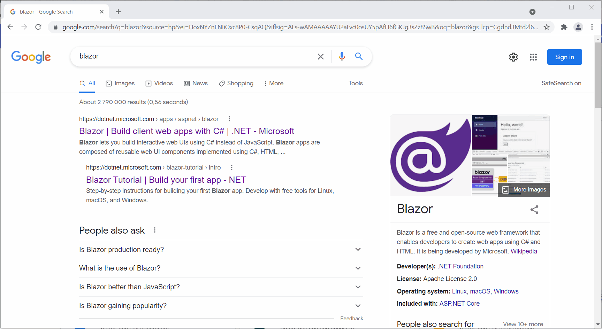

# New tab page sample

This sample project overrides the default new tab page and uses the bookmarks API.

You can load the output directly in the browser by following the steps [here](../README.md#test-the-sample-projects).