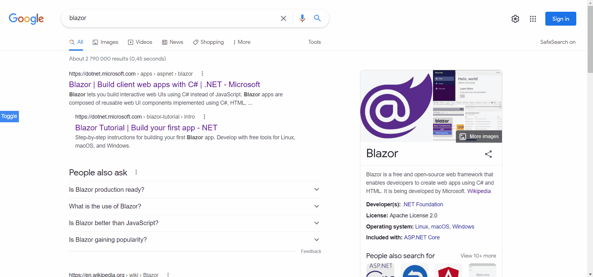

# Blazor.BrowserExtension.Samples

This repository contains samples of browser extensions built with Blazor using [Blazor.BrowserExtension](https://github.com/mingyaulee/Blazor.BrowserExtension).

Each directory contains the source file in `src` and the published files in `dist`.

## Samples

### New tab page

- Bookmarks API
- Override default new tab page

### Sidebar using content scripts

- Content scripts

## Test the sample projects
You can compile and load the projects yourself or just load the published files directly in the browser.

### Google Chrome
1. Launch the Extensions page ( ⋮ → More tools → Extensions) or navigate to the URL [chrome://extensions/](chrome://extensions/).
2. Switch on `Developer mode`.
3. Click on the `Load unpacked` button, then navigate to `sampleproject\dist` and select the folder `browserextension`.

### Microsoft Edge
1. Launch the Extensions page ( ⋮ → Extensions) or navigate to the URL [edge://extensions/](edge://extensions/).
2. Click on the ☰ and switch on `Developer mode`.
3. Click on the button with the title `Load unpacked`, then navigate to `sampleproject\dist` and select the folder `browserextension`.

### Mozilla Firefox
1. Navigate to the URL [about:debugging#/runtime/this-firefox](about:debugging#/runtime/this-firefox).
2. Click on `Load Temporary Add-on...`, then navigate to `sampleproject\dist\browserextension` and select any file in the directory.

## Sample extensions without Blazor
There are plenty of sample extensions provided by Google and Mozilla which is based on JavaScript, HTML and CSS, all of which can be ported to Razor HTML and Blazor scoped CSS.

These samples are good references to how certain features can be implemented, including what API to use and how the manifest is declared.

1. [Google Chrome sample extensions](https://github.com/GoogleChrome/chrome-extensions-samples/tree/main/mv2-archive)
2. [MDN sample extensions](https://github.com/mdn/webextensions-examples)
3. [Example DevTools extension](https://github.com/firefox-devtools/extension-examples)
