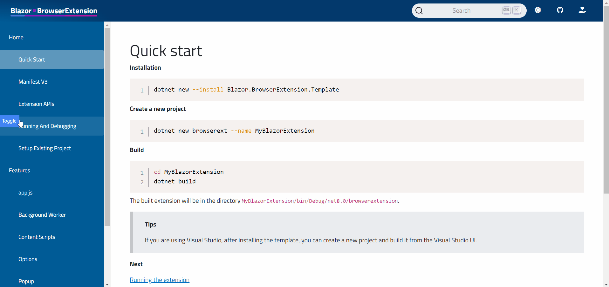

# Sidebar sample

This sample project uses content scripts to inject a iframe as a sidebar on every page and `postMessage` API for communication.

You can load the output directly in the browser by following the steps [here](../README.md#test-the-sample-projects).